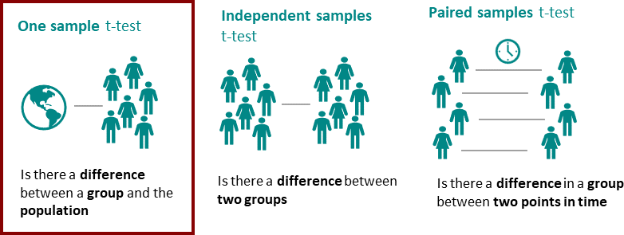

```{r setup, include=FALSE}
knitr::opts_chunk$set(echo = TRUE)
```

## Data analysis and statistics

This Markdown script will cover common aspects of data analysis as part of the Applied Sports Science Course at the University of Pittsburgh. Just like last week, all code will be written within the bounds of the `tidyverse`.

Last week, we learnt that we can import packages into R which allow us to perform predefined functions or operations on our data. While many packages need to be imported individually, certain packages, such as those in the `tidyverse` (i.e. ggplot2, tidyr, readr, etc.) also form a `suite` which can be imported as well, reducing the number of calls made dramatically. 


### Package and data import
We will first import the relevant packages, then import the data, just like last week.

```{r import packages, echo = TRUE, message = FALSE, warning = FALSE}
library(tidyverse)
library(corrplot)
library(RColorBrewer)
library(irr)
```


```{r import data, echo=TRUE, message = FALSE, warning = FALSE}
df <- read_csv('catapult_data.csv')
```

### Look at the data

Let's take a quick look into the data to see what we are dealing with.

```{r data glimpse, echo = TRUE, warning = FALSE, message = FALSE}
str(df)
dim(df)
head(df, 10)
```

The dataset from today's class is derived from Catapult data over the course of a full season.

### Data cleaning - Round I

As we learned last time, the first step before we actually get to analyze the data is to clean the data and decide what to do with outliers. In the interest of time, we will keep this section a little briefer this time and only focus on a few operations. We will visualize outliers based on `Total Distance` and `Total Duration` since we know based on the lietrature how long training sessions and the distances covered should approximately be. We will then convert `Total Duration` from seconds to hours and calculate the amount of `High-Speed Distance` and `Very High-Speed Distance` athletes covered based on the various Velocity Bands provided by **Catapult**. In reality, please note that the list of data cleaning operations may extend beyond those performed in this script.

```{r data cleaning, echo = TRUE, message = FALSE, warning = FALSE}
summary(df)

df %>%
  ggplot(aes(x = `Total Distance`)) +
  geom_histogram(fill = "grey81",
               color = "black")

max(df$`Total Distance`)

df_clean <- df %>%
  filter(`Total Distance` < 40000 & `Total Distance` > 0) %>%
  mutate(`Total Duration` = `Total Duration` / 3600, #since data is coded in seconds, but needs to be converted into hours (60s x 60minutes = 3600)
         HSD = `Velocity Band 5 Total Distance` + `Velocity Band 6 Total Distance` + `Velocity Band 7 Total Distance` + `Velocity Band 8 Total Distance`, #HSD > 5.5ms
         VHSD = `Velocity Band 7 Total Distance` + `Velocity Band 8 Total Distance`) # VHSD > 7m/s

# look at total distance
df_clean %>%
  ggplot(aes(x = `Total Distance`)) +
  geom_histogram(fill = "grey31",
               color = "black")

# look at total duration
df_clean %>%
  ggplot(aes(x = `Total Duration`)) +
  geom_histogram(fill = "grey31",
               color = "black")

df_clean <- df_clean %>%
  filter(`Total Duration` < 3 & `Total Duration` > 0.33)

# look at total duration again
df_clean %>%
  ggplot(aes(x = `Total Duration`)) +
  geom_histogram(fill = "grey31",
               color = "black",
               bins = 50)
```

### Data cleaning - Round II

After some basic physiological cleaning, it is often helpful to have another round of cleaning that is purely statistically driven. Whereas before, we ask whether a specific value is physiologically reasonable, now we rely solely on statistics to determine outliers. 

To help with this decision-making, remember the `interquartile rule` from last lecture. We can identify outliers by inspecting a boxplot. Keep in mind that boxplots are always group-specific. Knowing that starting status and whether or not a session is a game or training significantly influences the amount of minutes played/trained and thus all other outcomes, let's visualize those outcomes accordingly. We will start with `Total Player Load` - a metric that (if you recall) is derived by summing the tri-axial accelerations.

```{r, second round of data cleaning, echo = TRUE, message = FALSE, warning = FALSE}
df_clean %>%
  ggplot(aes(x = Starter, 
             y = `Total Player Load`)) +
  geom_boxplot(aes(fill = Game))

df_clean <- df_clean %>%
  mutate(`Total Player Load` = ifelse(Game == "Training" & `Total Player Load` > 800, NA, `Total Player Load`))

```

We can also repeat this process for many of our other KPIs, in this case `High-Speed Distance`, `Very High-Speed Distance`, and `Maximum Velocity`.

```{r, final round of data cleaning, echo = TRUE, message = FALSE, warning = FALSE}
df_clean %>%
  select(`Max Vel`, HSD, VHSD) %>%
  gather(key = "key",
         value = "value") %>%
  mutate(Starter = rep(df_clean$Starter, times = 3),
         date = rep(df_clean$date, times = 3),
         Game = rep(df_clean$Game, times = 3)) %>%
  ggplot(aes(x = Starter, 
             y = value)) +
  geom_boxplot(aes(fill = Game)) +
  facet_wrap(~key,
             scales = "free_y")

df_clean <- df_clean %>%
  mutate(`Total Player Load` = ifelse(Game == "Training" & `Total Player Load` > 800, NA, `Total Player Load`),
         `Max Vel` = ifelse(`Max Vel` < 12, NA, `Max Vel`))
```

To make our lives easier for the rest of this lecture, let's only focus on the match data for now.

```{r, extract game data, warning = FALSE, message = FALSE, echo = TRUE}
df_games <- df_clean %>%
  filter(Game == "Game" & `Total Duration` > 1.1)
```

## Statistics introduction

### Correlation

Now that we have a working dataset, let's learn a little bit about statistics. Often times we are interested in the degree to which two outcomes relate to one another. In other words, individuals where X is higher, is Y also higher? This type of question would involve a `correlation`.

```{r, correlation, echo = TRUE, message = FALSE, warning = FALSE}
df_clean %>%
  ggplot(aes(x = HSD, y = VHSD)) +
  geom_point(aes(alpha = HSD)) +
  labs(x = "High-Speed Distance (m)",
       y = "Very High-Speed Distance (m)",
       alpha = "Magnitude")

## add a trendline
df_clean %>%
  ggplot(aes(x = HSD, y = VHSD)) +
  geom_point(aes(alpha = HSD)) +
  geom_smooth(method = "lm",
              color = "black",
              fill = "black") +
  labs(x = "High-Speed Distance (m)",
       y = "Very High-Speed Distance (m)",
       alpha = "Magnitude")

#statistical correltion analysis
cor.test(df_clean$HSD, df_clean$VHSD, method = "pearson")

```

As you can see, unsurprisingly, higher magnitudes in high-speed distance are accompanied by higher magnitudes in very high-speed distance. Since one variables increases as the other increases, we call this a *positive correlation*. The statistical analysis furthermore revealed that **~84.6%** of the variance in VHSD can be explained by HSD. Because the `p-value` is < 0.05, we know that this is "statistically significant".

### Correlation Matrix

Correlations are informative because they tell us how one variable is *associated* with another variable. Thus, correlations are often used to justify the importance of a specific variable for the measurement of another or to dmeonstrate that similar constructs can be assessed with other methods. One instance, in which it is also helpful to quantify the association between two variables is feature selection. WHen asking what variable to monitor for instance, one way to help your decision-making is to reduce the number of variables by separating those that provide unique insight from those that contribute the same information. We can perform correlations at large scale using `correlation matrices`. In the below, we use the `corrplot` packages to visualize the Pearson correlation between all variables in the `df_games` dataframe.

```{r, correlation matrix, echo = TRUE, message = FALSE, warning = FALSE}
df_games_num <- df_games %>%
  select_if(is.numeric) %>%
  select(-`IMA Dive Intensity Left Low Count`, -`IMA Dive Intensity Right Low Count`,
         -`IMA Dive Intensity Left Med Count`, -`IMA Dive Intensity Right Med Count`,
         -`IMA Dive Intensity Left High Count`, -`IMA Dive Intensity Right High Count`,
         -`Velocity Band 8 Total Distance`, -`Total Live Play`) %>%
  na.omit()

### use the corr() function to correlate all values with one another
df_games_cor <- cor(df_games_num)

corrplot(df_games_cor,
         method = "color",
         tl.cex = 0.6,
         tl.col = "black",
         order = "hclust")
```


### T-test

Instead of asking about the association between two variables, we are sometimes also interest in differences between two groups. One example would be whether or not starters and non-starters have differences in physical characteristics. 



In the following, we will first group our athletes by starting status, then calculate the `Maximum Velocity` for each athlete and convert the variable from **mph** to **m/s**. Next, we will visualize the Top Speed for starters and non-starters. Finally, we will perform a student's test - the statistical comparison used to determine if the difference between two groups is greater than that observed if the null hypothesis were to be true (i.e. the groups are similar and difference is solely measurement error).

[t-test stats](images/t-test_stats.png)

Let's run it.


```{r, t-test, echo = TRUE, message = FALSE, warning = FALSE}
df_test <- df_games %>%
  dplyr::group_by(user_uid, Starter) %>%
  dplyr::summarise(MaxVel = max(`Max Vel`, na.rm = TRUE) * 0.44704) #mph to m/s

df_test %>%
  ggplot(aes(x = Starter,
             y = MaxVel)) +
  labs(y = "Maximum Velocity (m/s)") +
  geom_boxplot(aes(fill = Starter))

t.test(MaxVel ~ Starter, data = df_test)
```

As indicated by the p-value, the two groups appear to differ in Maximum Velocity, with starters being faster than non-starters. While this is an example of a `between-group comparison` (starters vs. non-starters), we are also sometimes interest in changes within the same individual. While `independent T-tests` are excellent for comparing two groups, `paired T-test` are the equivalent when comparing individuals across two instances. 

A simple example would be to compare each starters average training to match running speed:

```{r, paired t-test, echo = TRUE, message = FALSE, warning = FALSE}
df_starter_game_training <- df_clean %>%
  dplyr::group_by(user_uid, Game) %>%
  dplyr::summarise(MaxVel = mean(`Max Vel`, na.rm = TRUE) * 0.44704) #convert to m/s

# calculate means for convenient overlay
df_starter_game_training_mean <- df_starter_game_training %>%
  dplyr::group_by(Game) %>%
  dplyr::summarise(MaxVel = mean(MaxVel))

df_starter_game_training %>%
  ggplot(aes(x = Game, y = MaxVel)) +
  geom_point(aes(color = user_uid), alpha = 0.5) +
  geom_line(aes(group = user_uid,
                color = user_uid),
            alpha = 0.5) +
  geom_point(data = df_starter_game_training_mean,
             aes(x = Game, y = MaxVel),
             size = 3,
             color = "grey21") +
  geom_line(data = df_starter_game_training_mean,
             aes(x = Game, y = MaxVel),
            group = 1,
            size = 2,
             color = "grey21") +
  labs(y = "Maximum Velocity (m/s)") +
  theme(legend.position = "none")

t.test(MaxVel ~ Game, paired = TRUE, data = df_starter_game_training)
```


### Analysis of Variance (ANOVA)

Whereas t-tests can tell us if there is a statistical difference between two groups, analyses of variance can tell us whether there is a difference between more than two groups. Hence, ANOVAs would be a good choice when comparing positions in Maximum Velocity, for instance. 

[ANOVA](images/anova-diagram.svg)

Let's hop right into it.

```{r, ANOVA, echo = TRUE, message = FALSE, warning = FALSE}
df_positional_maxvel <- df_clean %>%
  dplyr::group_by(user_uid, Position) %>%
  dplyr::summarise(MaxVel = max(`Max Vel`, na.rm = TRUE) * 0.44704)

df_positional_maxvel %>%
  ggplot(aes(x = Position, y = MaxVel)) +
  geom_boxplot(aes(fill = Position))
  
positional_aov <- aov(MaxVel ~ Position, data = df_positional_maxvel)

summary(positional_aov)
```

### Pairwise comparisons

Since the F-statistic of the ANOVA was high and p-value < 0.05, we would conclude that Maximum Velocity differs across playing positions. While that's insightful, it does not tell us yet which position's Maximum Velocity is higher (or lower) than all others, for instance. To figure this out, we need to compute `Pairwise comparisons`. You only compute pairwise comparisons after the omnibus-ANOVA test indicates statistical significance, in order to avoid an inflation of statistical comparisons, which would increase the risk for a *statistical output with p<0.05 that occured solely due to chance*, otherwise known as **p-hacking**.

Please note that we typically introduce some sort of correction to account for the large number of multiple comparisons when we perform pairwise comparisons. Without going into too much detail, you can adjust the `p.adj` argument to use various methods. Ben Whalley does a good job covering multiple comparison in his book **Just enough R**, which you can access on GitHub: https://benwhalley.github.io/just-enough-r/multiple-comparisons.html

```{r, pairwise comparisons, echo = TRUE, message = FALSE, warning = FALSE}
pairwise.t.test(df_positional_maxvel$MaxVel, df_positional_maxvel$Position, p.adj = "none")
pairwise.t.test(df_positional_maxvel$MaxVel, df_positional_maxvel$Position, p.adj = "bonferroni")
pairwise.t.test(df_positional_maxvel$MaxVel, df_positional_maxvel$Position, p.adj = "hochberg")
pairwise.t.test(df_positional_maxvel$MaxVel, df_positional_maxvel$Position, p.adj = "fdr")
```

Based on this output you can see that our conclusions - which position differs from one another would vary (some are more conservative and others more leniant). Yet, all methods suggest that goalkeeprs (GK) are slower than wingers (W) which is not too surprising.

### Repeated-measures ANOVA

When we monitor individuals over multiple timepoints (not just two timepoints as in the paired t-test) this is a special case of a one-way ANOVA since we need to take into account the fact that each timepoint is not independent from one another. To accommodate this, we need to specify an `Error` argument within the `aov()` function. 

[ANOVA factors](images/between_within_factors.png)

In this case **user_uid** is sampled repeatedly, so this belongs into the `Error` call.

```{r, RMANOVA, echo = TRUE, warning = FALSE, message = FALSE}
df_rmanova <- df_clean %>%
  mutate(Weekday = lubridate::wday(date, label = TRUE)) %>%
  filter(Game != "Game")

df_rmanova %>%
  ggplot(aes(x = Weekday, y = `Max Vel` * 0.44704)) +
  geom_boxplot(aes(fill = Weekday)) +
  labs(y = "Maximum Velocity (m/s)")

weekday_aov <- aov(`Max Vel` ~ factor(Weekday) + Error(factor(user_uid)/Weekday), data = df_rmanova)

summary(weekday_aov)
```

### Mixed ANOVA

What if we want to know if the positional difference in Maximum Velocity is specific to matches or generally evident in games **and** training? This is where `Mixed ANOVAs` come into effect. In essence, we just introduced a **between-subject factor** (Position) and added another **within-subject factor** (Game vs. Training). 

[ANOVA table](images/ANOVA_table.png)

We can easily use the syntax within the `aov()` function to accommodate both of these factors.

```{r, mixed ANOVA, echo = TRUE, message = FALSE, warning = FALSE}
df_positional_game_maxvel <- df_clean %>%
  filter(Position != "GK") %>%
  dplyr::group_by(user_uid, Game, Position) %>%
  dplyr::summarise(MaxVel = max(`Max Vel`, na.rm = TRUE) * 0.44704)

df_positional_game_maxvel %>%
  ggplot(aes(x = Position, y = MaxVel)) +
  geom_boxplot(aes(fill = Position)) +
  facet_wrap(~Game)
  
game_positional_aov <- aov(MaxVel ~ Position * Game + Error(factor(user_uid)/Game), data = df_positional_game_maxvel)

summary(game_positional_aov)
```

### Test-retest reliability, standard error of measurement & minimum detectable change

A final important concept to understand is whether or not **statistical significance** also means that this result is **practically meaningful**. Unfortunately, the two are not always synonymous. 

To answer this question, we need to first learn a little bit more about the `test-retest reliability` of a measure. If a statistically significant difference is meaningful, it will **1) surpass a conceptual or anecdotal threshold and 2) be greater than measurement error**. So how do we determine this? 

The first step is to calculate `intraclass correlation coefficients` or short `ICCs`. ICCs are very similar to your typical Pearson correlations but they are a special case because they typically refer to the same measure obtained at two instances (same day = **intrasession** or two days = **intersession**).

```{r, echo = TRUE, message = FALSE, warning = FALSE}
## first define our test-retest reliability function
reliability <- function(x){
  library(irr)
  baseline = x[,1]
  baseline_sd = sd(baseline)
  
  icc_df = icc(x, model = c("twoway"),
             type = c("consistency"),
             unit = c("average"), r0 = 0, conf.level = 0.95)
  
  # standard error of measurement
  sem = baseline_sd * (sqrt(1-icc_df$value))
  
  # minimum detectable change
  mdc = sem*1.96*sqrt(2)
  
  # put in a dataframe to put out when executing the function
  output = cbind(icc_df$value, icc_df$p.value, sem, mdc)
  colnames(output) <- c("ICC", "P-Value", "SEM" , "MDC")
  return(output) 
}

# need to import new data to run this analysis
df_reliability <- readr::read_csv('catapult_reliability.csv')

# extract maximum velocity from dataframe and specify to be a matrix to perform computations
df_maxvel <- df_reliability %>%
  select(MaxVel_New, MaxVel_Old) %>%
  as.matrix()

# visualize correlation between the two (which hints at but does not replace ICCs)
df_maxvel %>%
  as.data.frame() %>%
  ggplot(aes(x = MaxVel_New, y = MaxVel_Old)) +
  geom_point() +
  geom_smooth(method = "lm")

# run our reliability function on new dataframe and provide relevant test-retest reliability outcomes
reliability(df_maxvel)
```

### Normality

Remember last time we qualitatively discussed whether or not a variable is normally or non-normally distributed. Today, we will add a quantitative method known as the `Shapiro Wilk Test`, which tests whether or not the distribution of a variable is significantly different from a normal distribution. Thus, if `p < 0.05` the Shapiro Wilk test would tell us that the distribution is different from a normal distribution. In other words, it is non-normal.


```{r, normality, echo = TRUE, warning = FALSE, message = FALSE}
shapiro.test(df_games$`Max Vel`)
```

Indeed, the test indicates that `High-Speed Distance` is not normally distributed. This means we should have either transformed the variable using `logarithmic` or `square root transformations`, or use non-parametric tests for our statistical comparisons and correlations if we cannot resolve non-normality.

Let's first see if we can successfully transform those variables.

```{r, data transformation, echo = TRUE, warning = FALSE, message = FALSE}
# transform variables
df_games <- df_games %>%
  mutate(MaxVel_log = log(`Max Vel`),
         MaxVel_rec = 1/`Max Vel`,
         MaxVel_sqrt = sqrt(`Max Vel`))

# visualize histograms - logarithmic transformation
df_games %>%
  ggplot(aes(x = MaxVel_sqrt)) +
  geom_histogram(color = "black",
                 fill = "grey91")

shapiro.test(df_games$MaxVel_sqrt)

# visualize histograms - square root transformation
df_games %>%
  ggplot(aes(x = MaxVel_log)) +
  geom_histogram(color = "black",
                 fill = "grey41")

shapiro.test(df_games$HSD_sqrt)
```

Seems like the data is still non-normally dsitributed, so we should have gone ahead and account this is in our analysis section. Checking whether or not your data is normally distributed is vital since it is an `assumption` of almost all statistical tests we are about to perform. If one of the assumptions for each test is violated, it is typically not recommended to perform the test.

Additional information on data transformation can be found in this excellent Markdown by Fraser Myers on RPub: https://rpubs.com/frasermyers/627589

### Non-parametric tests


#### Spearman's Rank Correlation Coefficient
In the case that data transformations cannot resolve non-normality, we can use non-parametric alternatives. For correlations, we can for instance use the Spearman's Rank correlation coefficient instead of the Pearson correlation coefficient. All it takes is specifying the `method` argument to be `"spearman"` in our `cor.test()` function.

```{r, spearman rank correlation, echo = TRUE, warning = FALSE, message = FALSE}
cor.test(df_clean$HSD, df_clean$VHSD, method = "spearman")
```

As you can see, the outcome is very similar, so we can be more confident in the validity of the analysis.

#### Mann Whitney U Test

Whenever a **independent T-test** is inappropriate due to non-normality, we can perform an Mann Whitney U Test instead. To do so, we will use the `wilxoc.test()` function.

```{r, mann whitney U, echo = TRUE, message = FALSE, warning = FALSE}
wilcox.test(MaxVel ~ Game, data = df_starter_game_training, na.rm=TRUE, paired=FALSE, exact=FALSE, conf.int=TRUE)
```


#### Wilcoxon signed rank test

Whenever a **paired T-test** is inappropriate due to non-normality, we can perform an Wilcoxon signed rank test instead. To do so, we will use still use the `wilxoc.test()` function, but specify the `paired` argument as `TRUE`.

```{r, wilcoxon signed rank test, echo = TRUE, message = FALSE, warning = FALSE}
wilcox.test(MaxVel ~ Game, data = df_starter_game_training, na.rm=TRUE, paired=TRUE, exact=FALSE, conf.int=TRUE)
```

#### Kruskal Wallis Test

Whenever a **one-way ANOVA** is inappropriate due to non-normality, we can perform an Kruskal Wallis test instead. To do so, we will use still use the `kruskal.test()` function.

```{r, kruskal wallis test, echo = TRUE, warning = FALSE, message = FALSE}
kruskal.test(MaxVel ~ Position, data = df_positional_maxvel)
```

