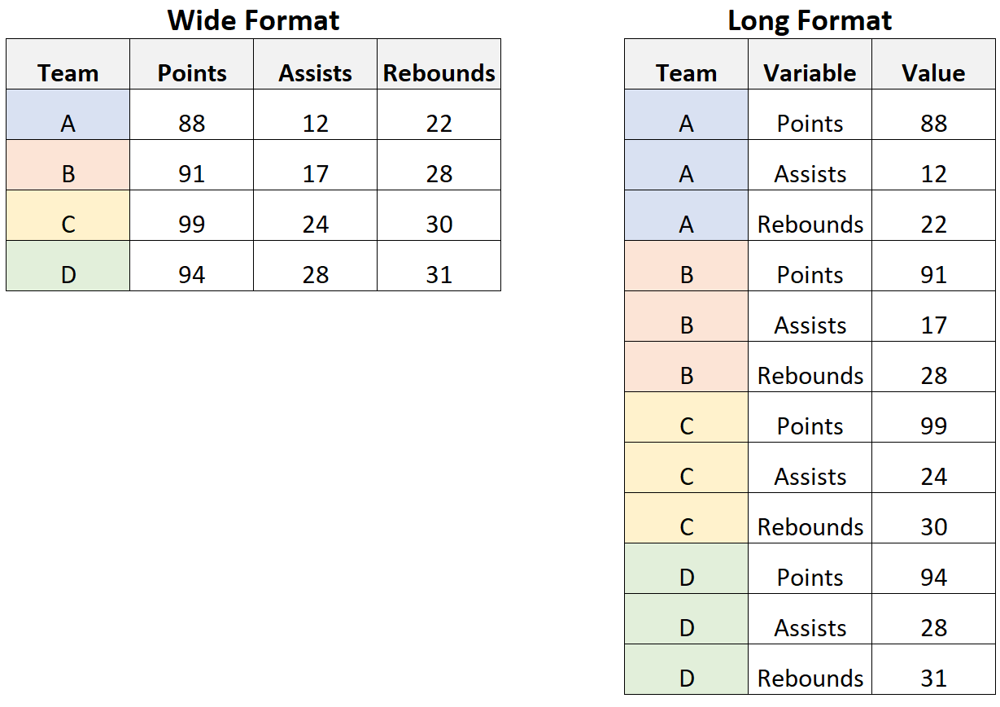

```{r setup, include=FALSE}
knitr::opts_chunk$set(echo = TRUE) # hashtag
```

## Introduction

This is an R Markdown document for the data cleaning and processing lecture of `HRS2665: Applied Sports Science` at the University of Pittsburgh. In this tutorial, you will learn how to import, wrangle and prepare data for subsequent statistical analysis and visualization. Doing so, you will learn the basics of the `tidyverse`: a series of **R packages** predominantly developed by Hadley Wickham and colleagues that is designed to simplify this process. You can learn more about the tidyverse here: https://www.tidyverse.org/packages/

Before we get started, a few words of wisdom from Hadley Wickham himself:
{width=500px}

### Additional resources:
**R for Data science:** https://r4ds.had.co.nz/
**Advanced R:** https://adv-r.hadley.nz/


### Import relevant packages

Before we import our dataset, we first need to import the libraries that provide the functions to clean and process our data. In this lecture, we will utilize the `readr`, `dplyr`, `plyr`, `tidyr`, `lubridate`, `forcats`, `stringr` and `ggplot2`.

```{r import packages, echo = TRUE, results='hide', message = FALSE, warning = FALSE}
library(readr)
library(dplyr)
library(plyr)
library(tidyr)
library(lubridate)
library(forcats)
library(stringr)
library(ggplot2)
```

**IF YOU CANNOT IMPORT THESE LIBRARIES YOU WILL NEED TO FIRST INSTALL THEM**
You can install packages by typing `install.packages("tidyr")` into the console on the bottom. Replace the name of the library in the call to install each package individually, or just run `install.packages("tidyverse")` to install the whole package suite.


### Data types

As a brief reminder, there are various data types in R. **Numeric** (i.e. numbers), **Characters** (i.e. strings), **Dates** and **Boolean** (i.e. TRUE/FALSE). We can combine these in vectors using the `c()` function. It is typically recommended to maintain one data type in the entire vector and to avoid combinations of numerics, characters, boolean and/or dates in the same vector.

```{r data types, echo = TRUE}
x <- 1
y <- 4

x
y

x + y

x_string <- "test"
x_string

x_string_num <- "1"
x_string_num

str(x_string_num)
str(x)


first_vector <- c(1, 2, 3, y, 5, 6, 7, y*2)
first_vector

bad_vector <- c(1, "1", 3, "test")
bad_vector

df_halloween <- data.frame(Day = c("Wednesday", "Thursday", "Friday", "Saturday"),
                           Excitement = c(100, 100, 100, 0),
                           Regret = c(0, 0, 0, 90))
df_halloween
```


### Import data

Now that we have the necessary functions to perform our operations, let's start by importing our dataset into R. You can think of this step as the equivalent to "double-clicking" your file and opening it in let's say Microsoft Excel. We will use the `read_csv()` function provided by the `readr` package. We will store the data under the variable name *df* which is a common abbreviation for *dataframe*.

```{r import data, echo = TRUE}
df <- read_csv('wellness_data.csv')
```

After running this line of code, you should have see a new variable **df** in your environment, consisting of 7469 observations and 14 variables. 

### Dataframe structure

To confirm the structure and dimensions of a dataframe, we can use simple *base R* syntax (`str()` and `dim()`).

```{r data structure, echo = TRUE}
str(df)
```

### Dataframe dimensions
```{r data dimensions, echo = TRUE}
dim(df)
```

### Data exploration

Now that you know you have the correct dataframe [7469, 14], let's explore what's stored "in" the dataframe, using the `head()` and `tail()` functions. Whereas `head()` will show us the top n- number of observations, `tail()` will show us the bottom n- number of observations in the dataframe.

```{r data exploration}
head(df, 5)
tail(df, 5)
```

Based on this initial exploration, we seem to have the following variables:
`date`: the date at which the athlete filled out the survey
`segment`: the specific body part that is sore and/or painful
`user_uid`: the user ID of the athlete (de-identified)
`Body Map Soreness`: the magnitude of soreness experience by the athlete for each body part (0-10 scale)
`Body Map Pain`: whether or not the athlete experiences pain in the specific body part (0 = No, 1 = Yes)
`Meals`: the number of meals eaten in the previous day
`Snacks`: the number of snacks eaten in the previous day
`Fatigue`: self-reported levels of fatigue (0-10, 10 = high, 0 = none)
`RPE_Physical`: physical ratings of perceived exertion (RPE) for the previous day's session (0-10)
`RPE_Mental`: cognitive/mental RPE for the previous day's session (0-10)
`Good_Stress`: the amount of energy devoted to challenges and opportunities
`Bad_Stress`: the amount of energy devoted to problems and difficulties

### Data summary

Knowing **what** the dataframe entails is helpful, but a **statistical summary** of our variables would be nice too. You can get a quick snapshot of some summary stats by using the `summary()` function. The function will also tell you the **type** of variable for each outcome. Remember from last lecture, there are *characters (strings), numeric, factors, dates, and Boolean (TRUE/FALSE)*.

```{r data summary, echo = FALSE}
summary(df)
```

As you can see in the above, date, segment and user_uid are characters (strings), whereas the rest are numerics since we can calculate the minimum, 1st quartile (i.e. 25th percentile), median (50th percentile), mean, 3rd quartile (i.e. 75th percentile) and maximum. You can also see the number of "NA"s (i.e., "not available"), which is a logical constant and indicates a missing value. Apparently there are quite many of them (5465), so let's take another look.

```{r NA / missing value, echo = FALSE}
head(df, 10)
```

### Subsetting and filtering

When looking at the data, you can see that the rows that contain NAs refer to individual instances in which athletes indicate the soreness level of specific body region. There may be multiple rows per day, so in order to work with the data, we first need to remove the rows that contain NAs. The `filter()` function allows you to conditionally extract specific rows from a dataframe. 

In the example below, all rows that are **not** *NA* in the segment column will be maintained and stored in a separate dataframe called *df_soreness*. We do this by **piping** (%>%) our existing dataframe, *df* and specifying that the segment cannot (`!=`) be NA. We can specify a different column to not contain any **NA** values to maintain all values specific to the rest of the wellness questionnaire in **df_wellness**. You could equally extract rows that **do** meet a specific character by using the operator `==` to indicate `equals to`.

```{r filtering, echo = TRUE}
df_soreness <- df %>%
  filter(segment != "NA")

dim(df_soreness)

df_wellness <- df %>%
  filter(Sleep_Duration_h != "NA")

dim(df_wellness)
```

We can use the `dim()` function to confirm that the dataframes are now smaller than the original and together make up the 5465 observations. 

We can alternatively drop values that contain missing values / NA using the `drop_na()` function.

```{r drop NA, echo = TRUE}
df_wellness2 <- df %>%
  drop_na(Sleep_Duration_h)

dim(df_wellness2)
```

If you notice that a specific row consists only of NAs, you can go ahead and remove the entire column. You can do so selectively using the `select()` function and specifying the column you would like to drop.

```{r select, echo = TRUE}
df_wellness_short <- df_wellness %>%
  select(-`Body Map Pain`, -`Body Map Soreness`, -segment)

dim(df_wellness_short)
```

You can see that there are now 11 columns compared to the original 14. 

If you remember from our call above using the `str()` function, the date column was actually not identified as a **date** variable but rather a **character**. You can access individual columns within a specific dataframe using the `$` sign.

```{r date variable type, echo = TRUE}
str(df_wellness_short$date)
```


### Renaming columns

Remember in our data hygiene class we talked about the fact that spaces in column names are a bad practice since they often complicate the computers' interpretation? This is a good example of the real-world whereby the spaces in `Body Map Soreness` and `Body Map Pain` are inevitable since they are **hardcoded** by Kinduct, meaning they cannot be changed. So, what we can do to make our lives easier is rename those columns. We can access the names of columns or rows using the `colnames()` and `rownames()` functions, respectively and then rename them by overwriring the call just like we would using dataframes.

```{r column rename, echo = TRUE}
colnames(df_soreness)

df_soreness_columns <- df_soreness

colnames(df_soreness_columns) <- c("date", "segment", "user_uid", "Body_Map_Soreness", "Body_Map_Pain",
                                   "Sleep_Duration_h", "Meals", "Snacks", "Drinks", "Fatigue", 
                                   "RPE_Physical", "RPE_Mental", "Good_stress", "Bad_stress", "Name")

# make the same call again
head(df_soreness_columns, 5)
```

You can still work with variables even when there are spaces (and I will show you later on how), but it often unnecessarily complicates scripts, so it's typically recommended to avoid this scenario in the first place.

### Date formatting

Another thing you may have caught earlier was that R thinks the date variable is a **chr** - short for **character**. As a result, R currently has no idea about the temporal interplay between dates and only identified the "text" of the date. In other words, if we were to analyze data across time, R would not understand that 8/17/22 comes one day after 8/16/22. 

To effectively work with this date column and analyze data over time, we need to teach R that these are actually dates and what format the dates are shown in. We can do so using the `mutate()` and `as.Date()` functions and overwrite our existing dataframe by storing the dataframe under the same name. To confirm that everything worked out as intended, we can rerun the previous line of code and it should now reflect a **Date**, rather than **character** variable.

```{r date formatting, echo = TRUE}
df_wellness_short <- df_wellness_short %>%
  mutate(date = as.Date(date, format = "%m/%d/%y")) #the format in which the date is presented, in this case month/day/year

str(df_wellness_short)
```

### Outlier removal

Now that we have a working dataset we might be interested in analyzing these values at the group or individual level. Before we get to this, we need to figure out if there are any outliers in the dataset and if so, what to do with them. We can look at the distribution of our outcomes holistically in one call or later on when analyzing each variable individually. Let's say we want to analyze sleep of our athletes - we can inspect a boxplot of `Sleep_Duration_h` column. We can visualize boxplots using the `ggplot2` package and the `geom_boxplot()` function.

```{r outliers, echo = TRUE}
df_wellness_short %>%
  ggplot(aes(y = Sleep_Duration_h)) + #create the structure of the graph and specify sleep as the y-variable
  geom_boxplot()
```

As indicated by the black dots outside of the boxplot, outliers are often defined by the `interquartile rule`, meaning that **a datapoint becomes an outlier if it's greater than 1.5 x the interquartile range (IQR) above the third quartile or smaller than 1.5 x the IQR below the first quartile**. Clearly, the few datapoint where sleep was 0h would skew our data and are most likely incorrect. In contrast, the ~3h of sleep could be possible, so let's use the `filter()` function to isolate those instances and get a better idea of whether or not they are errors.

```{r outlier isolation, echo = TRUE}
df_outlier <- df %>%
  filter(Sleep_Duration_h <= 3)

dim(df_outlier)

head(df_outlier, 4)
```

There are 4 observations where sleep was **equal to or smaller than** (`<=`) 3h. The 2 observations with sleep = 0, all other outcomes were 0 as well, suggesting that these are non-physiological. As such, we will remove those two instances but keep the remaining rows. Now we will use the `filter()` function to maintain only those rows that meet the 3h sleep criterion.

```{r outlier removal, echo = TRUE}
df_clean <- df %>%
    filter(Sleep_Duration_h >= 3)

df_clean %>%
  ggplot(aes(y = Sleep_Duration_h)) +
  geom_boxplot()
```

### Individual data cleaning: if-else statements and facet_wrap()

Notice that the **distribution** of our data changed since we removed the 0h sleep instances, so there are no more outliers remaining. We can potentially reiterate this process at the individual level. First, we visualize all data per individual using the `facet_wrap()` function and the `user_uid` column. Then, we could combine a conditional `ifelse()` statement and the `mutate()` call to selectively remove outliers in a new dataframe *df_clean_individual*.

```{r outlier removal individual, echo = TRUE}
df_clean %>%
  ggplot(aes(y = Sleep_Duration_h)) + #specify sleep as the y-variable
  geom_boxplot(aes(fill = user_uid)) + #specify the color of the boxplot based on each individual athlete
  facet_wrap(~user_uid,
             scales = "free_y") + #create one boxplot per individual athlete
  theme(legend.position = "none")

#outlier removal for one individual athlete
df_clean_individual <- df %>%
      mutate(Sleep_Duration_h = ifelse(user_uid == "0hckqtkj0eypznvd" & Sleep_Duration_h > 9, NA, Sleep_Duration_h))


df_clean_individual %>%
  filter(user_uid == "0hckqtkj0eypznvd") %>%
  ggplot(aes(y = Sleep_Duration_h)) + #specify sleep as the y-variable
  geom_boxplot(aes(fill = user_uid)) + #specify the color of the boxplot based on each individual athlete
  facet_wrap(~user_uid,
             scales = "free_y") + #create one boxplot per individual athlete
  theme(legend.position = "none")
```

### Data processing

Now that we think we have a *clean dataset*, it's time to process this data. *Data processing* refers to the derivation of new variables off of existing data and/or their trends over time. The simplest form of processing would for instance include calculating the **maximum, minimum, median, mean, standard deviation or area under the curve (AUC)** without any additional processing. We can do this in R using **base syntax**: `max()`, `min()`, `median()`, `mean()`, `sd()`.

```{r simple processing, echo = TRUE}
#maximum
max(df_clean$Sleep_Duration_h)
#minimum
min(df_clean$Sleep_Duration_h)
#median
median(df_clean$Sleep_Duration_h)
#mean
mean(df_clean$Sleep_Duration_h)
#sd
sd(df_clean$Sleep_Duration_h)
```

Just to reiterate why the cleaning was necessary - if we were to repeat these calculations on the original dataframe *df*, we would get no results.

```{r simple processing bad input, echo = TRUE}
#maximum
max(df$Sleep_Duration_h, na.rm = TRUE)
#minimum
min(df$Sleep_Duration_h, na.rm = TRUE)
#median
median(df$Sleep_Duration_h)
#mean
mean(df$Sleep_Duration_h)
#sd
sd(df$Sleep_Duration_h)
```

But how do you decide whether to go with the mean or median? Answer: it depends on the distribution of the data! If the distribution is *normal* or *bell-shaped*, it is typically best practice to calculate the *mean*. However, if the distribution is *non-normal* or *skewed*, calculating the *median* (i.e. the middle value of all rank-ordered inputs) would be more appropriate since it is less influenced by extreme points (i.e. values that are close to being outliers and deviate from the mean but don't qualify as an outlier quite yet). Below are two examples of the two distributions using our existing data.

```{r distributions, echo = TRUE, message = FALSE, warning = FALSE}
df_wellness_short %>%
  ggplot(aes(x = Sleep_Duration_h)) +
  geom_histogram()

df_clean %>%
  ggplot(aes(x = Sleep_Duration_h)) +
  geom_histogram()
```


### Data grouping

Once we have made up our mind on how we would like to process the data (i.e. using the mean or median, for instance), we can use the `group_by()` and `summarise()` functions from the `dplyr` package to process this data and conveniently derive some summary statistics. Depending on how many **factors** we incorporate into the `group_by()` call, we can process the data in a variety of ways.

```{r grouping, echo = TRUE, message = FALSE, warning = FALSE}
# summarize by athlete
df_clean %>%
  dplyr::group_by(user_uid) %>%
  dplyr::summarise(Sleep_mean = mean(Sleep_Duration_h),
            Sleep_median = median(Sleep_Duration_h),
            Sleep_max = max(Sleep_Duration_h),
            Sleep_min = min(Sleep_Duration_h),
            Sleep_sd = sd(Sleep_Duration_h))

# summarize by date
df_clean %>%
  filter(date < "2022-10-01") %>% #filter more recent dates to avoid to large outcomes
  dplyr::group_by(date) %>%
  dplyr::summarise(Sleep_mean = mean(Sleep_Duration_h),
            Sleep_median = median(Sleep_Duration_h),
            Sleep_max = max(Sleep_Duration_h),
            Sleep_min = min(Sleep_Duration_h),
            Sleep_sd = sd(Sleep_Duration_h))

# summarize by date and athlete
df_clean %>%
  filter(date < "2022-10-01") %>% #filter more recent dates to avoid to large outcomes
  dplyr::group_by(date, user_uid) %>%
  dplyr::summarise(Sleep_mean = mean(Sleep_Duration_h),
            Sleep_median = median(Sleep_Duration_h),
            Sleep_max = max(Sleep_Duration_h),
            Sleep_min = min(Sleep_Duration_h),
            Sleep_sd = sd(Sleep_Duration_h))

```


### Create a new variable

Earlier, we used `mutate()` to update an existing column together with an if-else statament. We can also create *new variables* using `mutate()`. A common way to use this function is for instance to group players as starters and non-starters. If we know what athlete (or in this case user_uid) is a starter and who is a non-starter, we can quickly combine starters into a vector and then specify that *if the name appears in this list, call it a starter and if not, call it a non-starter*.

```{r create new variable, echo = TRUE}
# vector to utilize later
starters <- c("rhhydf3xuhx96u3s", "8l06q1c60kw91azx",
              "3chsbm61gn4at3go", "qbnq4zi3suo1y0j0",
              "d3rcumg3b6nj22fx", "0pm3o7mdzzk5pz4z",
              "rvwzre6i1u8yjwpk", "ecwcano7lql2kscf",
              "rqsg00m6080l0cme")

df_clean_starter <- df_clean %>%
  mutate(Starter = ifelse(user_uid %in% starters, "Starter", "Non-starter"))

head(df_clean_starter, 100)

df_clean_starter %>%
  dplyr::group_by(Starter) %>%
  tally()
```

### Data merging

Remember? Before we dove into this whole processing and cleaning pipeline, we separated our *df* dataframe into a *df_soreness* and a *df_wellness*. What if we needed to combine these two dataframes now to run some statistics or create some graphs? We can use the `merge()`, `inner_join()`, `full_join()`, `left_join()` or `right_join()` functions to do so, but first we need to select only the variables that are important to avoid overlaps (and thus duplicating) variables between dataframes and calculate the maximum soreness value for each athlete and day (since currently there are multiple soreness values at various body regions per athlete).

```{r merging, echo = TRUE, warning = FALSE, message = FALSE}
df_soreness_clean <- df_soreness %>%
  select(date, user_uid, `Body Map Pain`, `Body Map Soreness`) %>%
  dplyr::group_by(date, user_uid) %>%
  dplyr::summarise(Soreness = max(`Body Map Soreness`),
                   Pain = max(`Body Map Pain`))

df_wellness_clean <- df_wellness %>% select(-`Body Map Soreness`, -`Body Map Pain`)

df_left_join <- left_join(df_wellness_clean, df_soreness_clean,
                      by = c("user_uid", "date")) #specifcy columns by whcih to merge

df_outer_join <- full_join(df_wellness_clean, df_soreness_clean,
                      by = c("user_uid", "date")) #specifcy columns by whcih to merge

df_inner_join <- inner_join(df_wellness_clean, df_soreness_clean,
                      by = c("user_uid", "date")) #specifcy columns by whcih to merge

df_merge <- merge(df_wellness_clean, df_soreness_clean,
                      by = c("user_uid", "date")) #specifcy columns by whcih to merge

dim(df_soreness_clean)
dim(df_wellness_clean)
dim(df_merge)
dim(df_left_join)
dim(df_inner_join)
```

You can see based on the dimensions that we went from 798 observations in the **df_soreness_clean** dataframe to 2004 to assign each soreness value to a day (or add a NA if no soreness was indicated) in the **df_wellness** dataframe and thus blend the two dataframes. As you can see `left_join()` and `full_join()` produce different results than `inner_join()` and `merge()`. 


**merge() and inner_join()**
Inner Join in R is the simplest and most common type of join. It is also known as simple join or Natural Join. inner_join() returns the rows when matching condition is met. merge() function by default performs inner join there by return only the rows in which the left table have matching keys in the right table.

**full_join()**
Outer Join in  R combines the results of both left and right outer joins. The joined table will contain all records from both the tables.

**left_join() and right_join()**
left_join() in R returns all records from the left dataframe (*df_wellness_clean*), and the matched records from the right dataframe (*df_soreness_clean*). Conversely, right_join() in R returns all records from the right dataframe (*df_soreness_clean*), and the matched records from the left dataframe (*df_wellness_clean*).


### Long and wide dataframes

In this last little piece of `data cleaning`, we will cover how to switch between wide and long data formats. First of all, what are wide and long datasets?


Depending on the software you use to analyze data (i.e. R, Python, Excel, SPSS, PRISM, etc.), your data needs to be structured either long or wide. To visualize data in R (especially the `ggplot2` package), data typically needs to be structured in long format. If your data is not already structured in long format (ours luckily was), you can use the `gather()` or `pivot_longer()` function to go from wide to long. If your data is already structured wide, but you need to go long (SPSS for instance needs data in this format for statistical analysis), you can use the `spread()` or `pivot_wider()` functions.

To demonstrate how to change the data organization, let's use the firat dataframe we created: *df_halloween*.

```{r long wide data, echo = TRUE}
head(df_halloween)

# long to wide
df_halloween_wide <- df_halloween %>%
  pivot_wider(names_from = Day, values_from = c(Excitement, Regret))

df_halloween_wide


df_halloween_long <- df_halloween_wide %>%
  gather(key = "key", value = "value")

df_halloween_long


df_halloween %>%
  gather(key = "key", value = "value") %>%
  filter(key != "Day") %>%
  mutate(Day = rep(df_halloween$Day, times = 2))
```


